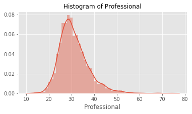
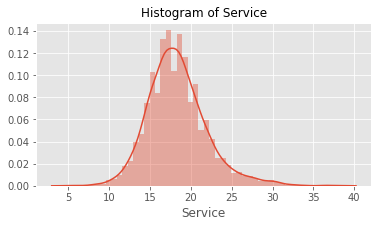
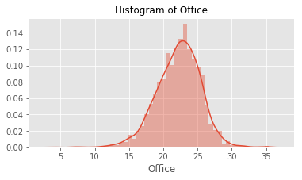

# AWS-Sagemaker with Jupyter Notebooks

### Step 1: Loading the data from Amazon S3


```python
##Import Libraries

import os
import boto3
import io
import sagemaker

%matplotlib inline 

import pandas as pd
import numpy as np
import mxnet as mx
import matplotlib.pyplot as plt
import matplotlib
import seaborn as sns
matplotlib.style.use('ggplot')
import pickle, gzip, urllib, json
import csv
```


```python
## Get IAM role created for notebook instance --'AmazonSageMakerFullAccess' role needed

from sagemaker import get_execution_role
role = get_execution_role()

role
```

## Starting Boto3 client to interact with AWS Bucket


```python
s3_client = boto3.client('s3')
data_bucket_name='aws-ml-blog-sagemaker-census-segmentation'
```

## List of Objects within Bucket


```python
obj_list=s3_client.list_objects(Bucket=data_bucket_name)
file=[]
for contents in obj_list['Contents']:
    file.append(contents['Key'])
print(file)
['acs2015_county_data.csv', 'counties/']
file_data=file[0]
```

    ['Census_Data_for_SageMaker.csv']


## Get data from CSV file in Bucket


```python
response = s3_client.get_object(Bucket=data_bucket_name, Key=file_data)
response_body = response["Body"].read()
counties = pd.read_csv(io.BytesIO(response_body), header=0, delimiter=",", low_memory=False) 
```

## First 5 rows of data


```python
counties.head()
```


<div>
<style scoped>
    .dataframe tbody tr th:only-of-type {
        vertical-align: middle;
    }

    .dataframe tbody tr th {
        vertical-align: top;
    }

    .dataframe thead th {
        text-align: right;
    }
</style>
<table border="1" class="dataframe">
  <thead>
    <tr style="text-align: right;">
      <th></th>
      <th>CensusId</th>
      <th>State</th>
      <th>County</th>
      <th>TotalPop</th>
      <th>Men</th>
      <th>Women</th>
      <th>Hispanic</th>
      <th>White</th>
      <th>Black</th>
      <th>Native</th>
      <th>...</th>
      <th>Walk</th>
      <th>OtherTransp</th>
      <th>WorkAtHome</th>
      <th>MeanCommute</th>
      <th>Employed</th>
      <th>PrivateWork</th>
      <th>PublicWork</th>
      <th>SelfEmployed</th>
      <th>FamilyWork</th>
      <th>Unemployment</th>
    </tr>
  </thead>
  <tbody>
    <tr>
      <th>0</th>
      <td>1001</td>
      <td>Alabama</td>
      <td>Autauga</td>
      <td>55221</td>
      <td>26745</td>
      <td>28476</td>
      <td>2.6</td>
      <td>75.8</td>
      <td>18.5</td>
      <td>0.4</td>
      <td>...</td>
      <td>0.5</td>
      <td>1.3</td>
      <td>1.8</td>
      <td>26.5</td>
      <td>23986</td>
      <td>73.6</td>
      <td>20.9</td>
      <td>5.5</td>
      <td>0.0</td>
      <td>7.6</td>
    </tr>
    <tr>
      <th>1</th>
      <td>1003</td>
      <td>Alabama</td>
      <td>Baldwin</td>
      <td>195121</td>
      <td>95314</td>
      <td>99807</td>
      <td>4.5</td>
      <td>83.1</td>
      <td>9.5</td>
      <td>0.6</td>
      <td>...</td>
      <td>1.0</td>
      <td>1.4</td>
      <td>3.9</td>
      <td>26.4</td>
      <td>85953</td>
      <td>81.5</td>
      <td>12.3</td>
      <td>5.8</td>
      <td>0.4</td>
      <td>7.5</td>
    </tr>
    <tr>
      <th>2</th>
      <td>1005</td>
      <td>Alabama</td>
      <td>Barbour</td>
      <td>26932</td>
      <td>14497</td>
      <td>12435</td>
      <td>4.6</td>
      <td>46.2</td>
      <td>46.7</td>
      <td>0.2</td>
      <td>...</td>
      <td>1.8</td>
      <td>1.5</td>
      <td>1.6</td>
      <td>24.1</td>
      <td>8597</td>
      <td>71.8</td>
      <td>20.8</td>
      <td>7.3</td>
      <td>0.1</td>
      <td>17.6</td>
    </tr>
    <tr>
      <th>3</th>
      <td>1007</td>
      <td>Alabama</td>
      <td>Bibb</td>
      <td>22604</td>
      <td>12073</td>
      <td>10531</td>
      <td>2.2</td>
      <td>74.5</td>
      <td>21.4</td>
      <td>0.4</td>
      <td>...</td>
      <td>0.6</td>
      <td>1.5</td>
      <td>0.7</td>
      <td>28.8</td>
      <td>8294</td>
      <td>76.8</td>
      <td>16.1</td>
      <td>6.7</td>
      <td>0.4</td>
      <td>8.3</td>
    </tr>
    <tr>
      <th>4</th>
      <td>1009</td>
      <td>Alabama</td>
      <td>Blount</td>
      <td>57710</td>
      <td>28512</td>
      <td>29198</td>
      <td>8.6</td>
      <td>87.9</td>
      <td>1.5</td>
      <td>0.3</td>
      <td>...</td>
      <td>0.9</td>
      <td>0.4</td>
      <td>2.3</td>
      <td>34.9</td>
      <td>22189</td>
      <td>82.0</td>
      <td>13.5</td>
      <td>4.2</td>
      <td>0.4</td>
      <td>7.7</td>
    </tr>
  </tbody>
</table>
<p>5 rows × 37 columns</p>
</div>


### Step 2: Exploratory Data Analysis (EDA)- Data cleaning and Exploration

## Cleaning the data


```python
counties.shape
```


    (3220, 37)


```python
## Drop missing data

counties.dropna(inplace=True)
counties.shape
```


    (3218, 37)


```python
## Combining descriptive columns for Index: 'state-county'

counties.index=counties['State'] + "-" + counties['County']
counties.head()
```


<div>
<style scoped>
    .dataframe tbody tr th:only-of-type {
        vertical-align: middle;
    }

    .dataframe tbody tr th {
        vertical-align: top;
    }

    .dataframe thead th {
        text-align: right;
    }
</style>
<table border="1" class="dataframe">
  <thead>
    <tr style="text-align: right;">
      <th></th>
      <th>CensusId</th>
      <th>State</th>
      <th>County</th>
      <th>TotalPop</th>
      <th>Men</th>
      <th>Women</th>
      <th>Hispanic</th>
      <th>White</th>
      <th>Black</th>
      <th>Native</th>
      <th>...</th>
      <th>Walk</th>
      <th>OtherTransp</th>
      <th>WorkAtHome</th>
      <th>MeanCommute</th>
      <th>Employed</th>
      <th>PrivateWork</th>
      <th>PublicWork</th>
      <th>SelfEmployed</th>
      <th>FamilyWork</th>
      <th>Unemployment</th>
    </tr>
  </thead>
  <tbody>
    <tr>
      <th>Alabama-Autauga</th>
      <td>1001</td>
      <td>Alabama</td>
      <td>Autauga</td>
      <td>55221</td>
      <td>26745</td>
      <td>28476</td>
      <td>2.6</td>
      <td>75.8</td>
      <td>18.5</td>
      <td>0.4</td>
      <td>...</td>
      <td>0.5</td>
      <td>1.3</td>
      <td>1.8</td>
      <td>26.5</td>
      <td>23986</td>
      <td>73.6</td>
      <td>20.9</td>
      <td>5.5</td>
      <td>0.0</td>
      <td>7.6</td>
    </tr>
    <tr>
      <th>Alabama-Baldwin</th>
      <td>1003</td>
      <td>Alabama</td>
      <td>Baldwin</td>
      <td>195121</td>
      <td>95314</td>
      <td>99807</td>
      <td>4.5</td>
      <td>83.1</td>
      <td>9.5</td>
      <td>0.6</td>
      <td>...</td>
      <td>1.0</td>
      <td>1.4</td>
      <td>3.9</td>
      <td>26.4</td>
      <td>85953</td>
      <td>81.5</td>
      <td>12.3</td>
      <td>5.8</td>
      <td>0.4</td>
      <td>7.5</td>
    </tr>
    <tr>
      <th>Alabama-Barbour</th>
      <td>1005</td>
      <td>Alabama</td>
      <td>Barbour</td>
      <td>26932</td>
      <td>14497</td>
      <td>12435</td>
      <td>4.6</td>
      <td>46.2</td>
      <td>46.7</td>
      <td>0.2</td>
      <td>...</td>
      <td>1.8</td>
      <td>1.5</td>
      <td>1.6</td>
      <td>24.1</td>
      <td>8597</td>
      <td>71.8</td>
      <td>20.8</td>
      <td>7.3</td>
      <td>0.1</td>
      <td>17.6</td>
    </tr>
    <tr>
      <th>Alabama-Bibb</th>
      <td>1007</td>
      <td>Alabama</td>
      <td>Bibb</td>
      <td>22604</td>
      <td>12073</td>
      <td>10531</td>
      <td>2.2</td>
      <td>74.5</td>
      <td>21.4</td>
      <td>0.4</td>
      <td>...</td>
      <td>0.6</td>
      <td>1.5</td>
      <td>0.7</td>
      <td>28.8</td>
      <td>8294</td>
      <td>76.8</td>
      <td>16.1</td>
      <td>6.7</td>
      <td>0.4</td>
      <td>8.3</td>
    </tr>
    <tr>
      <th>Alabama-Blount</th>
      <td>1009</td>
      <td>Alabama</td>
      <td>Blount</td>
      <td>57710</td>
      <td>28512</td>
      <td>29198</td>
      <td>8.6</td>
      <td>87.9</td>
      <td>1.5</td>
      <td>0.3</td>
      <td>...</td>
      <td>0.9</td>
      <td>0.4</td>
      <td>2.3</td>
      <td>34.9</td>
      <td>22189</td>
      <td>82.0</td>
      <td>13.5</td>
      <td>4.2</td>
      <td>0.4</td>
      <td>7.7</td>
    </tr>
  </tbody>
</table>
<p>5 rows × 37 columns</p>
</div>


```python
## Drop Columns

drop=["CensusId", "State", "County"]
counties.drop(drop, axis=1, inplace=True)
counties.head()
```


<div>
<style scoped>
    .dataframe tbody tr th:only-of-type {
        vertical-align: middle;
    }

    .dataframe tbody tr th {
        vertical-align: top;
    }

    .dataframe thead th {
        text-align: right;
    }
</style>
<table border="1" class="dataframe">
  <thead>
    <tr style="text-align: right;">
      <th></th>
      <th>TotalPop</th>
      <th>Men</th>
      <th>Women</th>
      <th>Hispanic</th>
      <th>White</th>
      <th>Black</th>
      <th>Native</th>
      <th>Asian</th>
      <th>Pacific</th>
      <th>Citizen</th>
      <th>...</th>
      <th>Walk</th>
      <th>OtherTransp</th>
      <th>WorkAtHome</th>
      <th>MeanCommute</th>
      <th>Employed</th>
      <th>PrivateWork</th>
      <th>PublicWork</th>
      <th>SelfEmployed</th>
      <th>FamilyWork</th>
      <th>Unemployment</th>
    </tr>
  </thead>
  <tbody>
    <tr>
      <th>Alabama-Autauga</th>
      <td>55221</td>
      <td>26745</td>
      <td>28476</td>
      <td>2.6</td>
      <td>75.8</td>
      <td>18.5</td>
      <td>0.4</td>
      <td>1.0</td>
      <td>0.0</td>
      <td>40725</td>
      <td>...</td>
      <td>0.5</td>
      <td>1.3</td>
      <td>1.8</td>
      <td>26.5</td>
      <td>23986</td>
      <td>73.6</td>
      <td>20.9</td>
      <td>5.5</td>
      <td>0.0</td>
      <td>7.6</td>
    </tr>
    <tr>
      <th>Alabama-Baldwin</th>
      <td>195121</td>
      <td>95314</td>
      <td>99807</td>
      <td>4.5</td>
      <td>83.1</td>
      <td>9.5</td>
      <td>0.6</td>
      <td>0.7</td>
      <td>0.0</td>
      <td>147695</td>
      <td>...</td>
      <td>1.0</td>
      <td>1.4</td>
      <td>3.9</td>
      <td>26.4</td>
      <td>85953</td>
      <td>81.5</td>
      <td>12.3</td>
      <td>5.8</td>
      <td>0.4</td>
      <td>7.5</td>
    </tr>
    <tr>
      <th>Alabama-Barbour</th>
      <td>26932</td>
      <td>14497</td>
      <td>12435</td>
      <td>4.6</td>
      <td>46.2</td>
      <td>46.7</td>
      <td>0.2</td>
      <td>0.4</td>
      <td>0.0</td>
      <td>20714</td>
      <td>...</td>
      <td>1.8</td>
      <td>1.5</td>
      <td>1.6</td>
      <td>24.1</td>
      <td>8597</td>
      <td>71.8</td>
      <td>20.8</td>
      <td>7.3</td>
      <td>0.1</td>
      <td>17.6</td>
    </tr>
    <tr>
      <th>Alabama-Bibb</th>
      <td>22604</td>
      <td>12073</td>
      <td>10531</td>
      <td>2.2</td>
      <td>74.5</td>
      <td>21.4</td>
      <td>0.4</td>
      <td>0.1</td>
      <td>0.0</td>
      <td>17495</td>
      <td>...</td>
      <td>0.6</td>
      <td>1.5</td>
      <td>0.7</td>
      <td>28.8</td>
      <td>8294</td>
      <td>76.8</td>
      <td>16.1</td>
      <td>6.7</td>
      <td>0.4</td>
      <td>8.3</td>
    </tr>
    <tr>
      <th>Alabama-Blount</th>
      <td>57710</td>
      <td>28512</td>
      <td>29198</td>
      <td>8.6</td>
      <td>87.9</td>
      <td>1.5</td>
      <td>0.3</td>
      <td>0.1</td>
      <td>0.0</td>
      <td>42345</td>
      <td>...</td>
      <td>0.9</td>
      <td>0.4</td>
      <td>2.3</td>
      <td>34.9</td>
      <td>22189</td>
      <td>82.0</td>
      <td>13.5</td>
      <td>4.2</td>
      <td>0.4</td>
      <td>7.7</td>
    </tr>
  </tbody>
</table>
<p>5 rows × 34 columns</p>
</div>


## Visualizing the Data


```python
import seaborn as sns

for a in ['Professional', 'Service', 'Office']:
    ax=plt.subplots(figsize=(6,3))
    ax=sns.distplot(counties[a])
    title="Histogram of " + a
    ax.set_title(title, fontsize=12)
    plt.show()
```

    /home/ec2-user/anaconda3/envs/mxnet_p36/lib/python3.6/site-packages/matplotlib/axes/_axes.py:6521: MatplotlibDeprecationWarning: 
    The 'normed' kwarg was deprecated in Matplotlib 2.1 and will be removed in 3.1. Use 'density' instead.
      alternative="'density'", removal="3.1")





    /home/ec2-user/anaconda3/envs/mxnet_p36/lib/python3.6/site-packages/matplotlib/axes/_axes.py:6521: MatplotlibDeprecationWarning: 
    The 'normed' kwarg was deprecated in Matplotlib 2.1 and will be removed in 3.1. Use 'density' instead.
      alternative="'density'", removal="3.1")





    /home/ec2-user/anaconda3/envs/mxnet_p36/lib/python3.6/site-packages/matplotlib/axes/_axes.py:6521: MatplotlibDeprecationWarning: 
    The 'normed' kwarg was deprecated in Matplotlib 2.1 and will be removed in 3.1. Use 'density' instead.
      alternative="'density'", removal="3.1")





```python
## Indicate Mean and Skew-- A typical county has ~ 25-30% Professional workers, with a right skew,
## long tail and a Prof. worker % max ~ 80% in some counties
```


```python
## Feature engineering

## minmaxscaler to transform numerical columns to fall between 0 and 1

from sklearn.preprocessing import MinMaxScaler
scaler = MinMaxScaler()
counties_scaled = pd.DataFrame(scaler.fit_transform(counties))
counties_scaled.columns = counties.columns
counties_scaled.index = counties.index

```

    /home/ec2-user/anaconda3/envs/mxnet_p36/lib/python3.6/site-packages/sklearn/preprocessing/data.py:334: DataConversionWarning: Data with input dtype int64, float64 were all converted to float64 by MinMaxScaler.
      return self.partial_fit(X, y)


```python
counties_scaled.describe()
```


<div>
<style scoped>
    .dataframe tbody tr th:only-of-type {
        vertical-align: middle;
    }

    .dataframe tbody tr th {
        vertical-align: top;
    }

    .dataframe thead th {
        text-align: right;
    }
</style>
<table border="1" class="dataframe">
  <thead>
    <tr style="text-align: right;">
      <th></th>
      <th>TotalPop</th>
      <th>Men</th>
      <th>Women</th>
      <th>Hispanic</th>
      <th>White</th>
      <th>Black</th>
      <th>Native</th>
      <th>Asian</th>
      <th>Pacific</th>
      <th>Citizen</th>
      <th>...</th>
      <th>Walk</th>
      <th>OtherTransp</th>
      <th>WorkAtHome</th>
      <th>MeanCommute</th>
      <th>Employed</th>
      <th>PrivateWork</th>
      <th>PublicWork</th>
      <th>SelfEmployed</th>
      <th>FamilyWork</th>
      <th>Unemployment</th>
    </tr>
  </thead>
  <tbody>
    <tr>
      <th>count</th>
      <td>3218.000000</td>
      <td>3218.000000</td>
      <td>3218.000000</td>
      <td>3218.000000</td>
      <td>3218.000000</td>
      <td>3218.000000</td>
      <td>3218.000000</td>
      <td>3218.000000</td>
      <td>3218.000000</td>
      <td>3218.000000</td>
      <td>...</td>
      <td>3218.000000</td>
      <td>3218.000000</td>
      <td>3218.000000</td>
      <td>3218.000000</td>
      <td>3218.000000</td>
      <td>3218.000000</td>
      <td>3218.000000</td>
      <td>3218.000000</td>
      <td>3218.000000</td>
      <td>3218.000000</td>
    </tr>
    <tr>
      <th>mean</th>
      <td>0.009883</td>
      <td>0.009866</td>
      <td>0.009899</td>
      <td>0.110170</td>
      <td>0.756024</td>
      <td>0.100942</td>
      <td>0.018682</td>
      <td>0.029405</td>
      <td>0.006470</td>
      <td>0.011540</td>
      <td>...</td>
      <td>0.046496</td>
      <td>0.041154</td>
      <td>0.124428</td>
      <td>0.470140</td>
      <td>0.009806</td>
      <td>0.760810</td>
      <td>0.194426</td>
      <td>0.216744</td>
      <td>0.029417</td>
      <td>0.221775</td>
    </tr>
    <tr>
      <th>std</th>
      <td>0.031818</td>
      <td>0.031692</td>
      <td>0.031948</td>
      <td>0.192617</td>
      <td>0.229682</td>
      <td>0.166262</td>
      <td>0.078748</td>
      <td>0.062744</td>
      <td>0.035446</td>
      <td>0.033933</td>
      <td>...</td>
      <td>0.051956</td>
      <td>0.042321</td>
      <td>0.085301</td>
      <td>0.143135</td>
      <td>0.032305</td>
      <td>0.132949</td>
      <td>0.106923</td>
      <td>0.106947</td>
      <td>0.046451</td>
      <td>0.112138</td>
    </tr>
    <tr>
      <th>min</th>
      <td>0.000000</td>
      <td>0.000000</td>
      <td>0.000000</td>
      <td>0.000000</td>
      <td>0.000000</td>
      <td>0.000000</td>
      <td>0.000000</td>
      <td>0.000000</td>
      <td>0.000000</td>
      <td>0.000000</td>
      <td>...</td>
      <td>0.000000</td>
      <td>0.000000</td>
      <td>0.000000</td>
      <td>0.000000</td>
      <td>0.000000</td>
      <td>0.000000</td>
      <td>0.000000</td>
      <td>0.000000</td>
      <td>0.000000</td>
      <td>0.000000</td>
    </tr>
    <tr>
      <th>25%</th>
      <td>0.001092</td>
      <td>0.001117</td>
      <td>0.001069</td>
      <td>0.019019</td>
      <td>0.642285</td>
      <td>0.005821</td>
      <td>0.001086</td>
      <td>0.004808</td>
      <td>0.000000</td>
      <td>0.001371</td>
      <td>...</td>
      <td>0.019663</td>
      <td>0.023018</td>
      <td>0.072581</td>
      <td>0.373402</td>
      <td>0.000948</td>
      <td>0.697279</td>
      <td>0.120861</td>
      <td>0.147541</td>
      <td>0.010204</td>
      <td>0.150685</td>
    </tr>
    <tr>
      <th>50%</th>
      <td>0.002571</td>
      <td>0.002591</td>
      <td>0.002539</td>
      <td>0.039039</td>
      <td>0.842685</td>
      <td>0.022119</td>
      <td>0.003257</td>
      <td>0.012019</td>
      <td>0.000000</td>
      <td>0.003219</td>
      <td>...</td>
      <td>0.033708</td>
      <td>0.033248</td>
      <td>0.104839</td>
      <td>0.462916</td>
      <td>0.002234</td>
      <td>0.785714</td>
      <td>0.172185</td>
      <td>0.188525</td>
      <td>0.020408</td>
      <td>0.208219</td>
    </tr>
    <tr>
      <th>75%</th>
      <td>0.006594</td>
      <td>0.006645</td>
      <td>0.006556</td>
      <td>0.098098</td>
      <td>0.933868</td>
      <td>0.111758</td>
      <td>0.006515</td>
      <td>0.028846</td>
      <td>0.000000</td>
      <td>0.008237</td>
      <td>...</td>
      <td>0.056180</td>
      <td>0.048593</td>
      <td>0.150538</td>
      <td>0.560102</td>
      <td>0.006144</td>
      <td>0.853741</td>
      <td>0.243377</td>
      <td>0.256831</td>
      <td>0.030612</td>
      <td>0.271233</td>
    </tr>
    <tr>
      <th>max</th>
      <td>1.000000</td>
      <td>1.000000</td>
      <td>1.000000</td>
      <td>1.000000</td>
      <td>1.000000</td>
      <td>1.000000</td>
      <td>1.000000</td>
      <td>1.000000</td>
      <td>1.000000</td>
      <td>1.000000</td>
      <td>...</td>
      <td>1.000000</td>
      <td>1.000000</td>
      <td>1.000000</td>
      <td>1.000000</td>
      <td>1.000000</td>
      <td>1.000000</td>
      <td>1.000000</td>
      <td>1.000000</td>
      <td>1.000000</td>
      <td>1.000000</td>
    </tr>
  </tbody>
</table>
<p>8 rows × 34 columns</p>
</div>


## Step 3: Data modelling


```python
## Dimensionality reduction using PCA -- http://sagemaker.readthedocs.io/en/latest/pca.html

from sagemaker import PCA
bucket_name= 'census-data-example1'
num_components=33

pca_SM = PCA(role=role,
          train_instance_count=1,
          train_instance_type='ml.c4.xlarge',
          output_path='s3://'+ bucket_name +'/counties/',
            num_components=num_components)
```


```python
## Extracting numpy array from the DataFrame and explicitly casting to float32

train_data = counties_scaled.values.astype('float32')
```


```python
## record_set function converts numpy array into record set format needed for Amazon Sagemaker

## Fit function on PCA model, passing in training data, and spinning up a training instance or cluster to perform job


%time
pca_SM.fit(pca_SM.record_set(train_data))
```

    CPU times: user 3 µs, sys: 0 ns, total: 3 µs
    Wall time: 7.15 µs
    2020-04-20 00:38:05 Starting - Starting the training job...
    2020-04-20 00:38:06 Starting - Launching requested ML instances...
    2020-04-20 00:39:05 Starting - Preparing the instances for training......
    2020-04-20 00:39:47 Downloading - Downloading input data...
    2020-04-20 00:40:29 Training - Downloading the training image...
    2020-04-20 00:40:53 Uploading - Uploading generated training model
    2020-04-20 00:40:53 Completed - Training job completed
    Training seconds: 66
    Billable seconds: 66


```python
## Unzipping file with trained model artifacts from S2 Bucket -- Job name found under 'Training Jobs' in Sagemaker

job_name='pca-2020-04-20-00-38-05-377'
model_key = "counties/" + job_name + "/output/model.tar.gz"

boto3.resource('s3').Bucket(bucket_name).download_file(model_key, 'model.tar.gz')
os.system('tar -zxvf model.tar.gz')
os.system('unzip model_algo-1')
```


    2304


```python
## Load ND array using MXNet

import mxnet as mx
pca_model_params = mx.ndarray.load('model_algo-1')
```


```python
## Three groups of params in PCA model --mean if the 'subtract_mean' hyperparam is true --v: principal components --s: singular values of the comp. for PCA tranformatoin
## explained-varience-ratio ~=square(s)/ sum(square(s))

s=pd.DataFrame(pca_model_params['s'].asnumpy())
v=pd.DataFrame(pca_model_params['v'].asnumpy())
```


```python
## Variance by top 5 largest components ~72% of total variance in data

s.iloc[28:,:].apply(lambda x: x*x).sum()/s.apply(lambda x: x*x).sum()

```


    0    0.717983
    dtype: float32


